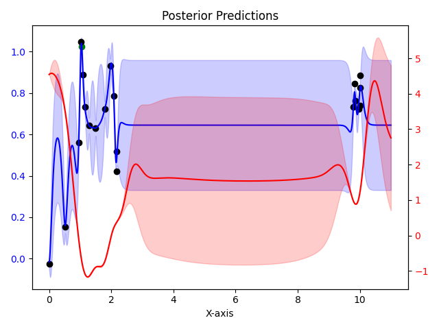

# Drug Discovery Optimization with Bayesian Methods

## Task Overview

This task involves leveraging **Bayesian Optimization** to optimize the structural features of a drug candidate, aiming to enhance its bioavailability while ensuring it remains feasible to synthesize. 

### Key Objectives:
1. **Maximize Bioavailability:** Represented by **logP**, a proxy metric for a candidate's bioavailability.  
2. **Satisfy Synthesizability Constraint:** Ensure the **Synthetic Accessibility score (SA)**, which measures synthesis difficulty, remains below a specified threshold \( \kappa = 4 \).

---

## Problem Formalization

The goal is to determine the optimal structural parameter \( x^* \in X \) such that:

\[
x^* \in \arg\max_{x \in X, v(x) < \kappa} f(x),
\]

where:
- \( f(x) \): Mapping from structural features \( x \) to logP (bioavailability).
- \( v(x) \): Mapping from \( x \) to SA (synthesizability).
- \( \kappa = 4 \): Maximum tolerable SA.

Both \( f(x) \) and \( v(x) \) are accessible only through **noisy evaluations**:
- \( y_f = f(x) + \epsilon_f, \; \epsilon_f \sim \mathcal{N}(0, \sigma_f^2), \; \sigma_f = 0.15 \).
- \( y_v = v(x) + \epsilon_v, \; \epsilon_v \sim \mathcal{N}(0, \sigma_v^2), \; \sigma_v = 0.0001 \).

### Constraints:
- A limited budget for exploring candidates where \( v(x_i) \geq \kappa \).
- The final solution must strictly satisfy \( v(x) < \kappa \).

---

## Optimization Framework

1. **Domain Definition:**  
   - \( X = [0, 10] \): The range of structural parameters \( x \).
   - \( f(x) \): Can be modeled using a Matérn kernel (\( \nu = 2.5 \)) or RBF kernel with variance \( 0.5 \) and tunable lengthscales (\( 10, 1, 0.5 \)).
   - \( v(x) \): Additive kernel combining Linear and Matérn (\( \nu = 2.5 \)) or RBF with variance \( \sqrt{2} \) and tunable lengthscales (\( 10, 1, 0.5 \)). The prior mean is \( 4 \).

2. **Bayesian Optimization:**  
   - Iteratively select \( x_i \) based on prior models and observed data to balance exploration (searching for new candidates) and exploitation (refining promising candidates).
   - Focus on kernels and hyperparameter tuning for optimal modeling of \( f(x) \) and \( v(x) \).

3. **Performance Metric:**  
   - The final objective is to beat a baseline score of \( 0.785 \).

---

## Key Challenges
- **Noisy Observations:** Both \( f(x) \) and \( v(x) \) are subject to Gaussian noise.
- **Constraint Satisfaction:** Synthesize only candidates with \( v(x) < \kappa \) while balancing exploration of infeasible regions within the budget.
- **Kernel Selection and Hyperparameter Tuning:** Choose suitable kernels and lengthscales for accurate modeling of \( f(x) \) and \( v(x) \).

---

## Results
- **Optimal Solution:** Score of \( 0.835 \) achieved with \( v(x) < \kappa \) for nearly all inference points.
- **Algorithm:** SAFE-OPT from [Safe Exploration for Optimization with Gaussian Processes](https://las.inf.ethz.ch/files/sui15icml-long.pdf)
- **Plotting:** Precise parameter tuning by analysing gaussian process and acquisition functions with increasing amount of data points.

